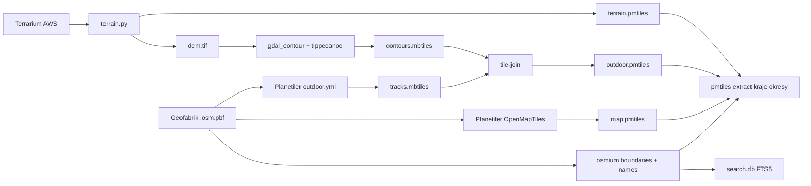

# Datová pipeline – offline mapy, tracktype, vrstevnice (Cloudflare R2)

Pipeline běží zdarma v GitHub Actions ([.github/workflows/data.yml](../.github/workflows/data.yml)). Jednou měsíčně (nebo na tvoje kliknutí) postaví data a nahraje je do tvého bucketu na Cloudflare R2. Appka si odtud stahuje offline regiony a online vrstvu enduro cest.

## Co pipeline vyrobí

Pro každý stát (výchozí Česko), každý kraj a každý okres:

| Soubor | Obsah | Česko (odhad) |
| --- | --- | --- |
| `map.pmtiles` | podkladová mapa (OpenMapTiles schéma, stejné jako OpenFreeMap), Planetiler | ~650 MB |
| `outdoor.pmtiles` | tracky s `tracktype`/`surface`/`smoothness`, zákazy vjezdu, `maxspeed`, vrstevnice po 10 m | ~150 MB |
| `terrain.pmtiles` | Terrarium DEM do zoomu 11 pro offline stínování | ~190 MB |
| `search.db` | offline hledání (SQLite FTS5): obce, ulice, POI, vrcholy | ~40 MB |

Kraje a okresy jsou výřezy (`pmtiles extract`) podle hranic z OSM. Celkem pro Česko vyjde zhruba 3 až 4 GB, takže se to vejde do 10 GB, které má R2 zdarma.

Dále vzniknou `catalog.json` (seznam regionů pro appku) a `regions.geojson` (polygony pro výběr na mapě).

## 1. Cloudflare R2 (zdarma)

1. Založ účet na <https://dash.cloudflare.com/sign-up>.
2. V levém menu otevři **R2 Object Storage** a aktivuj ho. Cloudflare chce při aktivaci platební kartu, ale do 10 GB úložiště, 1 milionu zápisů a 10 milionů čtení měsíčně **nic neplatíš** a stahování (egress) je zdarma vždy.
3. Klikni na **Create bucket** a dej název třeba `moje-mapy`.
4. V bucketu otevři **Settings → Public access → R2.dev subdomain** a klikni na **Allow**. Zkopíruj adresu ve tvaru `https://pub-xxxxxxxxxxxx.r2.dev`.
5. V **R2 → Manage API tokens → Create API token** zvol:
   - Permissions: **Object Read & Write**
   - Specify bucket: `moje-mapy`
   - Po vytvoření si opiš **Access Key ID**, **Secret Access Key** a **Account ID** (je vidět i v URL endpointu `https://<ACCOUNT_ID>.r2.cloudflarestorage.com`).

## 2. GitHub – tajné údaje

V repozitáři otevři **Settings → Secrets and variables → Actions**:

**Secrets** (tlačítko *New repository secret*):

| Název | Hodnota |
| --- | --- |
| `R2_ACCOUNT_ID` | Account ID |
| `R2_ACCESS_KEY_ID` | Access Key ID |
| `R2_SECRET_ACCESS_KEY` | Secret Access Key |
| `R2_BUCKET` | `moje-mapy` |

**Variables** (záložka *Variables*):

| Název | Hodnota |
| --- | --- |
| `DATA_BASE_URL` | `https://pub-xxxxxxxxxxxx.r2.dev` |

## 3. Spuštění

1. Otevři **Actions → Offline map data (build + upload to R2) → Run workflow**.
2. Pole *only* nech prázdné (postaví se státy s `"enabled": true` v [pipeline/countries.json](../pipeline/countries.json)).
3. Pro Česko to trvá zhruba 1 až 2 hodiny. Pak se data obnovují automaticky 1. den v měsíci.

Chceš i Slovensko, Rakousko nebo Polsko? V `countries.json` přepni `"enabled": true`. Pozor na limit 10 GB, jeden větší stát přidá 2 až 5 GB.

## 4. Propojení s appkou

- **Release build**: proměnná `DATA_BASE_URL` z kroku 2 se do appky vloží automaticky při buildu.
- **Development**: do souboru `.env` v kořeni projektu dej

  ```env
  EXPO_PUBLIC_DATA_BASE_URL=https://pub-xxxxxxxxxxxx.r2.dev
  ```

  a restartuj `npm start`.

V appce pak v **Nastavení → Offline mapy** uvidíš katalog. Barevné tracktype, zákazy vjezdu a vrstevnice se online zobrazí rovnou, bez stahování.

## Lokální spuštění (volitelné)

Pipeline je bash skript pro Linux. Na Windows ho spustíš ve WSL (Ubuntu 24.04):

```bash
sudo apt install osmium-tool gdal-bin python3-gdal python3-numpy python3-scipy python3-pil python3-shapely jq openjdk-21-jre
# tippecanoe: https://github.com/felt/tippecanoe  (make && sudo make install)
# pmtiles:    https://github.com/protomaps/go-pmtiles/releases
ONLY=cz bash pipeline/build.sh
```

## Jak jsou data poskládaná



Licence dat: © OpenStreetMap přispěvatelé (ODbL), OpenMapTiles schéma (BSD/CC-BY), Terrarium (Mapzen, AWS Open Data – SRTM, EU-DEM, …).
